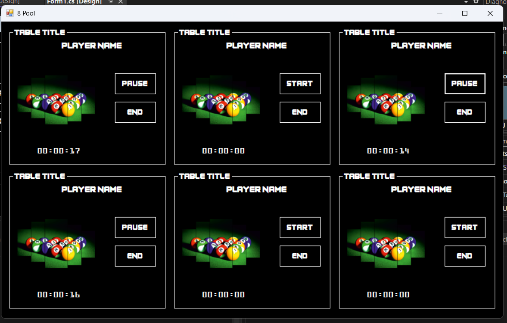
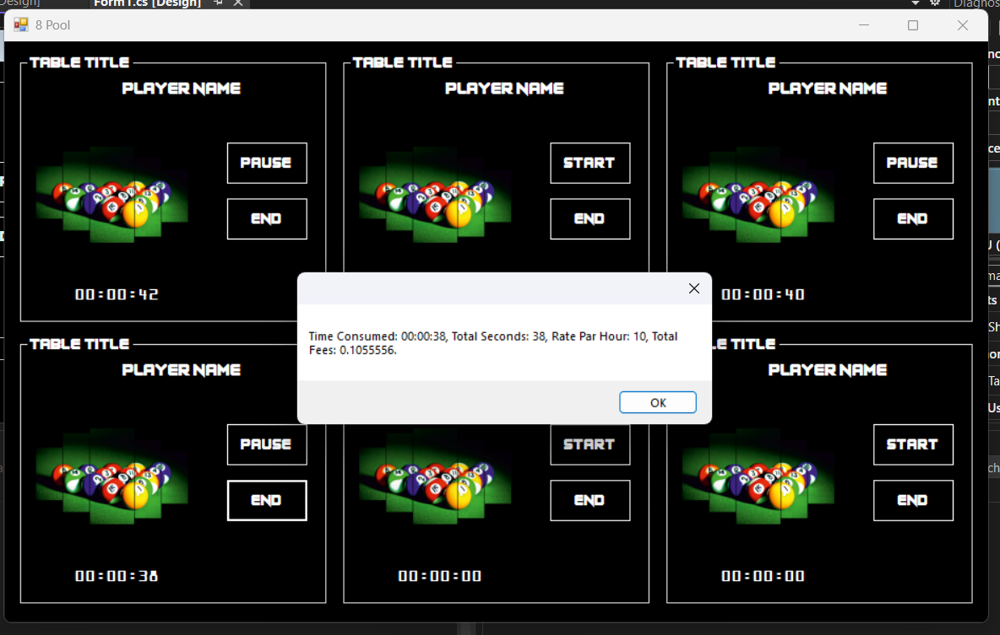

# 🎱 8-Pool Table Time Manager

A simple desktop application for managing and tracking playing time for 8-pool (billiards) tables.

---

## 📌 Overview

This project helps pool hall owners track the playing duration for each table and automatically calculate the total cost when the game ends.

Each table has its own independent timer, allowing staff to manage multiple tables simultaneously in an easy and organized way.

---

## ✨ Features

- ✅ Start timer for each table
- ⏸️ Pause timer anytime
- ▶️ Resume timer
- ⏹️ Stop/Finish session
- 🕒 Automatic time tracking
- 🧾 Result summary message
- 💰 Automatic fee calculation based on hourly rate

---

## 🧮 Results Shown After Finish

When a session ends, the application displays:

- Time in **hh:mm:ss**
- Time in **seconds**
- **Rate per hour**
- **Total fees to pay**

---

## 🖥️ How It Works

1. Select a table  
2. Click **Start** when the player begins  
3. Use **Pause/Resume** if needed  
4. Click **Stop/Finish** when the player leaves  
5. The system automatically calculates and displays the bill  

---

## 📸 Screenshots

---

## 🛠️ Technologies Used

- C#
- .NET WinForms
- Object-Oriented Programming (OOP)
- Events

---

## 👨‍💻 Author
- Yacine Ragueb  
- LinkedIn: [@yacineragueb](https://www.linkedin.com/in/yacine-ragueb-8033a9302/)
- My Website: [yacineragueb](https://yacineragueb.vercel.app/)
- Email: yacineddd32@gmail.com

